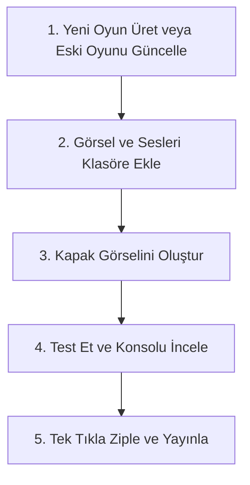

# Dijital İçerik Fabrikası Kullanım Kılavuzu (KULLANIM_KILAVUZU.md)

Bu kılavuz, ekibinizin yapay zeka (AI) yardımıyla hızlı, standartlara uygun ve hatasız eğitsel oyunlar ve simülasyonlar geliştirebilmesi için hazırlanmıştır.

---

## 1. İçerik Geliştirme ve Güncelleme Adımları

Yeni bir oyun tasarlarken veya eski bir oyunu güncellerken sırasıyla şu adımları izleyin:

### Adım 1: Yeni Oyun Üretme veya Eski Oyunu Güncelleme
*   **Yeni Oyun Üretme (Otomatik - Ajan ile):** Antigravity IDE üzerinden `/oyun` komutunu kullanarak senaryoya uygun yeni bir oyun klasörü oluşturun (Bkz. Ajan Promptları).
*   **Eski Oyunu Güncelleme (Otomatik - Ajan ile):** Standart dışı eski bir oyununuz varsa, proje ana dizininde `oyunguncelle/` adında bir klasör oluşturun (yoksa elle siz oluşturun), eski oyun klasörünü bu klasörün altına atın ve `/oyunguncelle` komutunu çalıştırın. Yapay zeka projeyi standart şablona uydurmak için analiz edip onayınızı isteyecek, onay verdiğinizde orijinal dosyaya dokunmadan `[oyun-adi]-guncellenmis/` adıyla yepyeni standart bir sürüm üretecektir.

### Adım 2: Görsel ve Ses Dosyalarını Hazırlama (Esnek Medya Akışı)
Tasarım yaratıcılığını kısıtlamamak adına bu adımda iki farklı yol izleyebilirsiniz:
*   **Yöntem A (Önceden Hazırlama):** Kullanacağınız görselleri `gorsel/`, sesleri `ses/` klasörüne önceden yükleyip yapay zekaya bunları kullanmasını söyleyebilirsiniz (örn: `gorsel/yesil_elma.png`).
*   **Yöntem B (Kodlamadan Sonra Hazırlama - Önerilen):** Görsel ve sesleri önceden hazırlamakla uğraşmadan doğrudan **Adım 1**'e geçebilirsiniz. Yapay zeka oyunu hayal gücüne göre kodlar, kodun içine standartlara uygun yerel dosya yolları tanımlar (örn: `gorsel/roket_ucusu.png`) ve kodlama bittiğinde size: *"Oyunu tamamladım. Çalışabilmesi için sizden şu isimlerle şu görselleri/sesleri klasöre eklemenizi rica ediyorum"* diyerek net bir ihtiyaç listesi sunar. Siz de sadece o dosyaları temin edip ilgili klasörlere atarsınız.

### Adım 3: Kapak Görseli Oluşturma
Oyun bittikten sonra kapak görselini elle hazırlamak yerine chat ekranına `/kapakuret [oyun-adi]` yazarak yapay zekaya 1:1 kare formatında premium kapak görselleri hazırlatabilirsiniz. Yapay zeka kaç adet (1–4) kapak istediğinizi sorar ve `[oyun-adi]-kapak-1.png` … `[oyun-adi]-kapak-4.png` biçiminde üretir. Bu işlem tamamen Python bağımsızdır ve doğrudan yapay zeka tarafından gerçekleştirilir.

---

## 2. Yapay Zeka (AI) Yönlendirme Kuralları (Prompting)

Yapay zekaya projenin kurallarına göre kod yazdırırken kullanacağınız araca göre aşağıdaki yönlendirmeleri (prompt) kopyalayıp yapıştırabilirsiniz:

#### Ajanlar veya Antigravity IDE Kullanıyorsanız:
Antigravity IDE kuralları (`.antigravity/rules.md`) arka planda otomatik olarak okur. Ajanın klasörü kopyalayıp oyunu yazması için şu promptu girmeniz yeterlidir:
> *"Lütfen projemizin rules.md kuralları ve MIMARI.md mimarisine uyarak: 1- sablon/ klasörünü kopyalayıp '[yeni-oyun-adi]' (Türkçe karaktersiz, küçük harflerle ve kelimeler arası tireli) adında yeni bir klasör oluştur. 2- Bu yeni klasördeki index.html dosyasını düzenleyerek [Oyun Detayları/Senaryosu] oyununu kodla. Görselleri gorsel/, sesleri ses/ klasöründen göreceli olarak çağır. Renk tasarımında rastgele renk geçişleri kullanma; Figma Color Combinations ve Gradients.app standartlarına uygun, kontrastı yüksek (WCAG AA uyumlu) ve belirli renk rollerine (Primary, Secondary, Success, Error, Background) sahip profesyonel bir palet oluştur."*

#### ChatGPT veya Claude Web Arayüzünü Kullanıyorsanız (Manuel Kopyalamadan Sonra):
Yapay zekaya `.antigravity/rules.md` ve `MIMARI.md` dosyalarını yükleyin (veya metinlerini yapıştırın) ve şu promptu yazın:
> *"Sana gönderdiğim rules.md kurallarına ve MIMARI.md mimarisine birebir uyarak, sana ilettiğim index.html şablonundaki kodları güncelle. Bu dosya içinde [Buraya Oyun Senaryonuzu Yazın] oyununu kodlayacaksın. Tasarımı premium yap; Figma Color Combinations ve Gradients.app standartlarına uygun, kontrastı yüksek (WCAG AA uyumlu) ve belirli renk rollerine (Primary, Secondary, Success, Error, Background) sahip profesyonel bir palet oluştur. Tüm ses ve görselleri yerel klasörlerden relative olarak oku, kesinlikle harici CDN veya internet adresi kullanma."*

---

## 3. Test Etme ve Hata Ayıklama

Yazılan oyunu tarayıcıda açtıktan sonra F12 tuşuna basarak **Geliştirici Konsolunu (Console)** açın.
*   Eğer konsolda **Kırmızı renkli** hata mesajları görüyorsanız, bu hatayı kopyalayarak yapay zekaya *"Oyunda şu hatayı alıyorum, düzelt"* diyerek iletin.
*   Oyunun akıllı tahta, tablet ve telefonlarda butonlarının kaymadığını, ekranın tam ortalandığını (Letterbox yapısı) gözle kontrol edin.

---

## 4. Paketi Yayına Hazırlama (Otomatik Zipleme)

Oyun sorunsuz çalıştığında, web sisteminize yüklemek üzere sıkıştırma işlemini tek tıkla yapabilirsiniz:
1.  Antigravity chat ekranına `/ziple [oyun-adi]` komutunu yazın.
2.  Yapay zeka, yerel sistemin kendi zipleme araçlarını kullanarak (Python bağımsız şekilde) kapak görsellerini oyun klasörünün içine koyar ve klasörü tek bir pakette birleştirir.
3.  Hem oyun klasörü hem de oluşturulan **`[oyun-adi].zip`** dosyası ana dizindeki **`oyunlar/`** klasörünün altına taşınır (klasör yoksa otomatik oluşturulur). `oyunlar/[oyun-adi].zip` dosyasını LMS veya web portalınıza doğrudan yükleyebilirsiniz.
