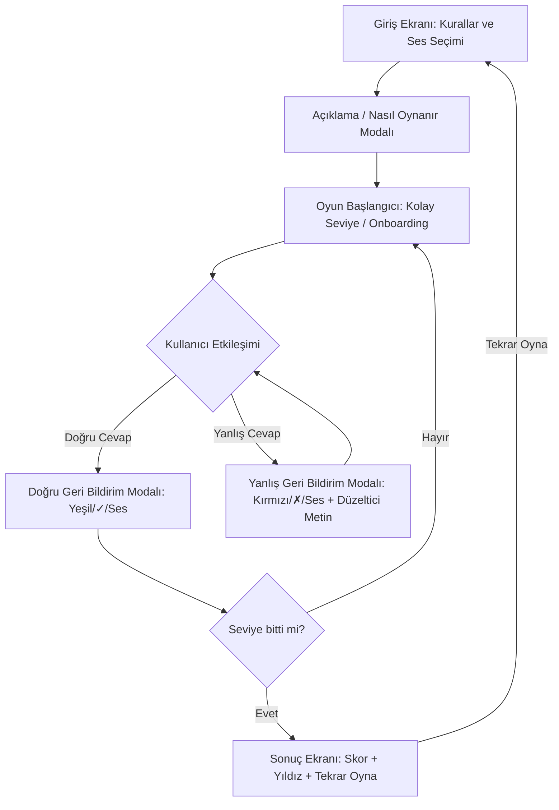

# Proje Mimari Kılavuzu (MIMARI.md)

Bu doküman, geliştirilecek e-içerik ve oyunların teknik altyapısını ve mimari şablonlarını açıklamaktadır. Projeler tasarlanırken bu belgedeki teknik standartlara uyulmalıdır.

---

## 1. Mimari Tasarım Deseni: Tek Dosya (Self-Contained)

Projelerin dağıtımı, taşınabilirliği ve LMS (Öğrenim Yönetim Sistemleri) üzerinde kolayca barındırılabilmesi için **Self-Contained (Kendine Yeten)** tek bir HTML dosyası mimarisi benimsenmiştir.

```text
[oyun-klasor-adi]/ (Ziplenerek yayınlanan ana klasör)
├── index.html     (HTML + Inline CSS + Inline JS)
├── gorsel/        (Yerel görseller: svg, png, jpg)
├── ses/           (Yerel ses efektleri: mp3, wav)
├── video/         (Yerel videolar: mp4)
└── font/          (Yerel yazı tipi dosyaları: woff2)
```

### Avantajları:
*   Tarayıcı önbellekleme (caching) sorunlarını en aza indirger.
*   Farklı web sunucularına veya portal altyapılarına yüklenirken dosya yolu bozulmalarını önler.
*   Tamamen çevrim dışı (offline) çalışma ortamı sağlar.

---

## 2. Ekran Uyumluluğu (Letterbox scaling) Mimarisi

Oyun alanının farklı en-boy oranlarına sahip ekranlarda (16:9 akıllı tahta, 4:3 tablet vb.) bozulmadan ve kaymadan çalışabilmesi için **Letterbox (Oran Korumalı Ölçekleme)** mimarisi uygulanır.

### CSS ve JS ile Ölçekleme Yaklaşımı:
Oyun alanı sabit bir çözünürlüğe (örn. `1280x720` px) kilitlenir. JavaScript, tarayıcı penceresinin boyutlarını izleyerek (`resize` eventi) oyun alanını en-boy oranını koruyarak `transform: scale()` yöntemiyle ölçekler ve tam ortalar.

#### Tasarım Şablonu:
*   **Dış Konteyner (`#game-container`):** Ekranı tamamen kaplar (`width: 100vw; height: 100vh; overflow: hidden;`).
*   **İç Konteyner (`#game-canvas`):** Sabit en-boy oranına sahiptir (`width: 1280px; height: 720px; transform-origin: center center;`).

```javascript
function resizeGame() {
    const canvas = document.getElementById('game-canvas');
    const windowWidth = window.innerWidth;
    const windowHeight = window.innerHeight;
    
    // 1280 / 720 = 1.7778 (16:9 oranı)
    const targetRatio = 1280 / 720;
    const currentRatio = windowWidth / windowHeight;
    
    let scale;
    if (currentRatio > targetRatio) {
        // Ekran daha geniş, yüksekliğe göre ölçekle
        scale = windowHeight / 720;
    } else {
        // Ekran daha dar, genişliğe göre ölçekle
        scale = windowWidth / 1280;
    }
    
    canvas.style.transform = `translate(-50%, -50%) scale(${scale})`;
}
window.addEventListener('resize', resizeGame);
window.addEventListener('load', resizeGame);
```

---

## 3. Matematiksel İfadeler (Yerel KaTeX) Mimarisi

Eğer bir oyun veya simülasyon yoğun matematiksel ifadeler (kesirler, köklü sayılar vb.) içeriyorsa, harici CDN kullanılmayacağı için yerel KaTeX yapısı entegre edilmelidir.

### Entegrasyon Adımları:
1.  KaTeX CSS, JS ve font dosyaları oyun klasörünün içinde `lib/katex/` dizinine yerleştirilir.
2.  HTML başlığında bu yerel dosyalar çağrılır:
    ```html
    <link rel="stylesheet" href="lib/katex/katex.min.css">
    <script defer src="lib/katex/katex.min.js"></script>
    ```
3.  Eğer formüller basit seviyedeyse, performansı artırmak adına KaTeX yüklemek yerine HTML **MathML** etiketleri (`<math>`, `<mfrac>`) veya saf **CSS/SVG** çizimleri tercih edilmelidir.

---

## 4. Ekran Akışı ve Durum Yönetimi (State Machine)

Her eğitsel oyun, MEB kılavuzunda belirtilen pedagojik akışı sağlamak için belirli ekran durumlarından geçmelidir:



### Ekran Durumlarının Yönetimi:
Tüm ekran geçişleri CSS sınıfları (`.active`, `.hidden`) üzerinden kontrol edilmelidir. Bu sayede tarayıcı performansı korunur ve gereksiz render işlemlerinin önüne geçilir.

---

## 5. Erişilebilirlik (Accessibility - WCAG 2.1) Altyapısı

*   **Ses ve Müzik Kontrolü (ayrı düğmeler):** Şablonun sağ üst kontrol barında **iki ayrı** düğme bulunur: ses efektleri için `#btn-audio-toggle` ve arka plan müziği için `#btn-music-toggle`. Bunlar `OYUN_DURUMU.ses_acik` ve `OYUN_DURUMU.muzik_acik` durumlarını yönetir; bu ikisini tek bir "Ses/Müzik" düğmesine birleştirmeyin.
*   **Durum Saklama (bellek tercih edilir):** Oyun durumu (ses/müzik/skor/seçim) `localStorage` yerine bellek içi global nesnede (`OYUN_DURUMU`) tutulmalıdır. Şablonda `localStorage` yalnızca tema tercihini (`oyun-tema`) kalıcı kılmak için kullanılır; `localStorage` çağrısı moderasyon statik analizinde **uyarı** (editör incelemesi) üretir (bkz. §9), bu yüzden kullanımını tema tercihiyle sınırlı tutun.
*   **Klavye ve Ekran Okuyucu Desteği:** Şablondaki etkileşimli ögeler (taşınabilir nesneler, bırakma hedefleri, butonlar) `tabindex`, `role="button"` ve açıklayıcı `aria-label` ile gelir; geri bildirim modalı `role="alertdialog"`, `aria-modal="true"` ve `aria-live="assertive"` taşır. Oyunu uyarlarken bu klavye/ARIA altyapısını koruyun ve yeni etkileşimli ögelere de uygulayın.
*   **Büyük Dokunma Alanları:** Butonlar ve etkileşimli alanlar, akıllı tahtada kolayca tıklanabilmesi için minimum **44x44 piksel** boyutlarında tasarlanmalıdır.
*   **Renk Dışı İşaretçiler:** Sadece renklere güvenilmemelidir. Doğru/yanlış ekranlarında yeşil/kırmızının yanında mutlaka "✓" ve "✗" sembolleri ile metin açıklamaları bulunmalıdır (Renk körü kullanıcılar için WCAG standardı).
*   **Okunabilirlik ve Kontrast:** Eğitim materyali üretildiği için, arka plan ile metin/buton renkleri arasındaki kontrast oranının okunabilirliği engellemeyecek şekilde (en az WCAG AA standartlarında) olmasını sağlayın.

---

## 6. Renk Paleti ve Tasarım Standartları

Oyunlarda ve materyallerde rastgele renk geçişleri veya uyumsuz renk paletleri kesinlikle kullanılmamalıdır. Tasarımlarda modern UI/UX trendlerini yansıtan, profesyonel renk kombinasyonları tercih edilmelidir:
*   **Renk Paleti Standartları:** Renk seçimlerinde her zaman kontrastı yüksek, birbirini tamamlayan (complementary) veya ardışık (analogous) profesyonel renk paletleri (Örn: [Figma Color Combinations](https://www.figma.com/resource-library/color-combinations/) standartları) kullanılmalıdır.
*   **Gradyan Mantığı:** Gradyan (gradient) geçişlerinde keskin ve kirli renklerden kaçınılmalıdır. [Gradients.app](https://gradients.app/tr/colorpalette) standartlarına uygun; yumuşak, opaklığı dengelenmiş, soft pasteller veya derin kurumsal neonlar gibi modern geçişler oluşturulmalıdır.
*   **Renk Rolleri:** Her oyun için tasarlanacak arayüzde şu roller kesin olarak tanımlanmalıdır:
    *   **Primary (Ana Eylem):** Kullanıcının tıklamasını istediğimiz birincil butonlar ve ana etkileşim ögeleri.
    *   **Secondary (İkincil Eylem):** Yardımcı butonlar, geri dön veya ayarlar gibi ikincil etkileşimler.
    *   **Success (Doğru Cevap):** Doğru geri bildirim pencereleri, doğru seçenek işaretleyicileri (örn. yeşil tonlar).
    *   **Error (Yanlış Cevap):** Hatalı eylem, yanlış cevap geri bildirimleri (örn. kırmızı tonlar).
    *   **Background (Arka Plan):** İçeriğin rahat okunmasını sağlayan arka plan rengi.

---

## 7. Tam Ekran Desteği (Fullscreen API) Mimarisi

Oyunların akıllı tahtalarda ve farklı cihazlarda tam ekran modunda çalışabilmesi için standart Fullscreen API entegrasyonu uygulanır:
*   **Arayüz Konumlandırması:** Sağ üst köşedeki kontrol barının (`.controls-group-right`) en sağında bir tam ekran butonu (`#btn-fullscreen-toggle`) ve iki adet durum ikonu (`#icon-fullscreen`, `#icon-exit-fullscreen`) bulunmalıdır.
*   **Fonksiyonel Akış:**
    *   Butona tıklandığında `toggleFullscreen()` fonksiyonu tetiklenir. Bu fonksiyon tarayıcı uyumluluğu gözetilerek (webkit, moz, ms) belgeyi tam ekran moduna geçirir veya tam ekrandan çıkarır.
    *   `fullscreenchange` (ve tarayıcı özel varyasyonları) olay dinleyicisi ile tarayıcı tam ekran durumundaki değişimleri izler ve `updateFullscreenIcons()` fonksiyonu aracılığıyla ilgili buton ikonlarını dinamik olarak günceller.

---

## 8. İçerik İzleme SDK'sı (Content Tracking) Mimarisi

Oyunlar platformda **izole bir iframe** içinde çalışır. Platform "içerik açıldı" değil, **"öğrenci ne öğrendi"** verisini (ilerleme, tamamlama, skor) toplar; bu veri MEB kazanım bazlı ilerleme panelleri ve AI önerileri için kullanılır. Bunun için oyun, host sayfaya `postMessage` ile konuşan hafif bir SDK kullanır.

*   **Gömülü ve Offline:** Şablonun `<script>` bloğunun başında, platformun `da-sdk.js` dosyasıyla birebir uyumlu, gömülü bir `DijitalAtolye` nesnesi bulunur. CDN yasağı gereği harici dosya çağrısı (`<script src="/da-sdk.js">`) yapılmaz; SDK kodu doğrudan oyunun içine gömülüdür ve tamamen offline çalışır. İframe dışında (örn. dosya doğrudan açıldığında) sessizce devre dışı kalır, hata vermez.
*   **API:**
    *   `DijitalAtolye.progress({ outcomeCode, score })` — Ara ilerleme / kısmi tamamlama.
    *   `DijitalAtolye.complete({ outcomeCode, score, durationSeconds })` — Oyun tamamlandı (final skor + süre).
    *   `DijitalAtolye.score({ outcomeCode, score })` — Yalnızca skor güncellemesi.
*   **Alanlar (hepsi opsiyonel):** `outcomeCode` (MEB kazanım kodu, max 32 karakter), `score` (0–100, host bu aralığa kısar), `durationSeconds` (etkinlik süresi).
*   **Kazanım Kodu:** Şablonda `const KAZANIM_KODU` sabiti bulunur; her oyun kendi MEB kazanım koduyla bunu günceller (örn. `'M.5.1.1'`).
*   **Çağrı Noktaları:** Doğru adımlarda `progress`, oyun bitiminde (`endGame`) `complete` çağrılır. `complete` gönderildiğinde host, kapanışta otomatik `Complete` yazmaz (çift sayım önlenir).

```javascript
// endGame içinde örnek tamamlama bildirimi:
DijitalAtolye.complete({
    outcomeCode: KAZANIM_KODU,
    score: Math.max(0, Math.min(100, OYUN_DURUMU.skor)),
    durationSeconds: gecenSaniye
});
```

---

## 9. İçerik Moderasyonu ve Statik Güvenlik Analizi (ZORUNLU)

Platforma yüklenen her oyun, yayına alınmadan önce otomatik bir **moderasyon hattından** (AIModeration servisi: `HtmlJsStaticAnalyzer` + LLM puanlama) geçer. HTML/JS statik olarak taranır; bulunan riskler bir karar matrisine girer (`ModerationDecisionRules`):

*   **En az bir "kritik" bulgu = otomatik RED.** Skor ne olursa olsun içerik reddedilir. Bu yüzden aşağıdaki API'ler ve kalıplar oyunlarda **kesinlikle kullanılmamalıdır:**
    *   `eval(`, `Function(` (dinamik kod çalıştırma)
    *   `document.write`, `document.cookie`
    *   `window.opener`, `navigator.geolocation`
    *   Whitelist dışı **dış (http/https) `<script src>`** çağrısı. (Proje standardı zaten tamamen offline/yerel olduğu için hiçbir dış script kullanılmamalıdır — bkz. CDN yasağı.)
*   **"Uyarı" düzeyindeki kalıplar otomatik reddetmez** ama içeriği editör incelemesine düşürür ve puanı düşürür; mümkünse kaçının:
    *   `localStorage.`, `indexedDB`, `navigator.sendBeacon`
    *   `fetch(`, `XMLHttpRequest` (ağ çağrısı) — oyunlar tamamen offline çalıştığı için gerek yoktur
    *   `<iframe>` kullanımı
*   **Sonuç:** Oyun tek dosyalık, tamamen offline ve yukarıdaki kritik API'lerden arınmış olduğunda moderasyondan sorunsuz geçer. İlerleme/tamamlama bildirimi yalnızca gömülü `DijitalAtolye` SDK'sının `postMessage` köprüsüyle yapılır (bkz. §8); bunun dışında host ile haberleşmeye veya ağ çağrısına ihtiyaç yoktur.

---

## 10. Giriş Ekranı Bileşenleri (Tema, Cihaz Rozetleri, Yatay Mod Uyarısı)

Şablonun giriş ekranı ve kontrol barı şu standart bileşenleri içerir; oyunu uyarlarken bunları koruyun:

*   **Tema (Açık/Koyu) Düğmesi (`#btn-theme-toggle`):** `toggleTheme()` ile açık/koyu tema arasında geçiş yapar. Tema değişiminde logo da değişir: koyu temada `gorsel/dark-mod-logo.png`, açık temada `gorsel/light-mod-logo.png` (`#img-logo`). Her iki logo da `gorsel/` altında bulunmalı ve **değiştirilmeden korunmalıdır**. Tema tercihi `localStorage`'da `oyun-tema` anahtarıyla saklanır.
*   **Cihaz Uyumluluk Rozetleri (`.home-badges-container`):** Giriş ekranında akıllı tahta, bilgisayar/tablet ve telefon uyumluluğunu gösteren SVG rozetleri yer alır. Rozetlerde **yalnızca ikon/görsel** gösterilir, yanlarına metin açıklaması yazılmaz. Yalnızca akıllı tahta uyumlu içeriklerde akıllı tahta rozeti vurgulanır.
*   **Yatay Mod Uyarısı (`#landscape-warning`):** Yalnızca yatay (landscape) oynanabilen oyunlarda, dikey tutulan cihazlarda "Cihazınızı yatay çevirin" animasyonlu uyarısı gösterilir.

