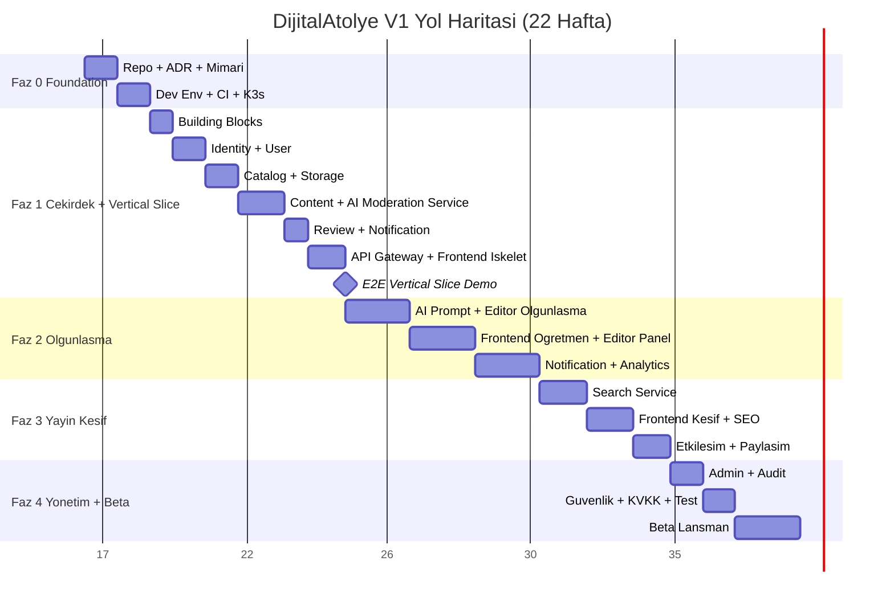
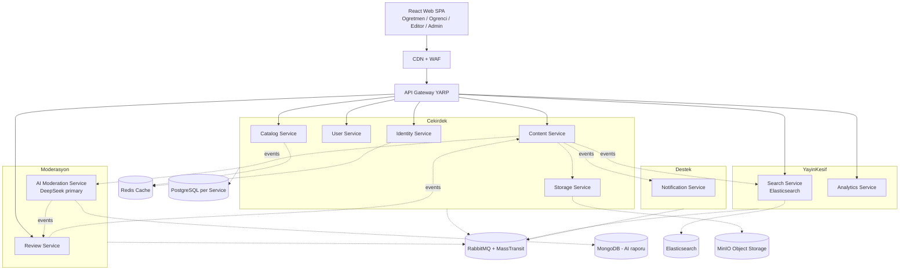

# DijitalAtölye V1 Kurulum Planı

## Bağlam

[`01-PRD-DijitalAtolye.md`](01-PRD-DijitalAtolye.md), [`02-Sistem-Mimarisi.md`](02-Sistem-Mimarisi.md), [`03-Todo-List.md`](03-Todo-List.md) dokümanları temel alınarak V1 sürümü için 22 haftalık (5 faz) bir uygulama planı tasarlandı. Workspace şu an boş — tüm kurulum sıfırdan yapılacak.

## Sapma Niteliğinde Kararlar (Mimari Dokümandan Farklı)

Aşağıdaki seçimler `02-Sistem-Mimarisi.md`'deki önerilerden saptığı için ADR'larda netleştirilmesi kritik:

- **Cloud:** GCP/Cloud Run yerine **self-hosted K3s + VPS** (Hetzner/DigitalOcean önerilir, Faz 0 ADR-008'de netleşecek)
- **LLM:** Gemini öncelikli yerine **DeepSeek primary** (maliyet odaklı), soyutlama ile Gemini/Claude fallback
- **AI Moderation:** Mock-first yerine **Faz 1'den itibaren gerçek LLM** (erken validasyon, ama Faz 1 token bütçesi gerekli)
- **Geliştirici Kaynağı:** Faz 1 tek geliştirici (Veli), **Faz 2+ ekip büyütme** (vertical slice ile başla, paralelleştirilebilir parçalara böl)

## Genel Yol Haritası (22 Hafta)

## Mimari Genel Bakış (10 Servis + Frontend)

## Vertical Slice Stratejisi (Faz 1 Kritik)

`03-Todo-List.md`'nin sonundaki "Tek başına geliştirme stratejisi" notuna uygun olarak Faz 1 sonunda **uçtan uca tek bir içerik yayını** çalışmalı. Bu, V1'in geri kalanı için en